# Machine Learning Core Foundation Framework

This document is a first-principles structure for understanding machine learning as a complete system, not only as model training.

The goal is to answer:

> When should a system use fixed logic, and when should it learn from data under assumptions that will remain true enough in the future to create useful decisions?

## Table of Contents

0. [Executive Map](#0-executive-map)
1. [Foundations Of Learning](#1-foundations-of-learning)
2. [ML In The Larger System Landscape](#2-ml-in-the-larger-system-landscape)
3. [Purpose And Problem Framing](#3-purpose-and-problem-framing)
4. [Data And Labels](#4-data-and-labels)
5. [Data Preparation And Feature Work](#5-data-preparation-and-feature-work)
6. [Model Strategy](#6-model-strategy)
7. [Training](#7-training)
8. [Evaluation And Validation](#8-evaluation-and-validation)
9. [Outputs And Decision Policies](#9-outputs-and-decision-policies)
10. [Interpretation And Trust](#10-interpretation-and-trust)
11. [Decisions, Actions, And Feedback Loops](#11-decisions-actions-and-feedback-loops)
12. [Causality, Experimentation, And Sequential Decisions](#12-causality-experimentation-and-sequential-decisions)
13. [Failure Modes](#13-failure-modes)
14. [Deployment And MLOps](#14-deployment-and-mlops)
15. [Monitoring And Improvement](#15-monitoring-and-improvement)
16. [Ethics, Governance, Privacy, And Security](#16-ethics-governance-privacy-and-security)
17. [Cost, ROI, And Practicality](#17-cost-roi-and-practicality)
18. [Cross-Cutting Spines](#18-cross-cutting-spines)
19. [Complete First-Principles Checklist](#19-complete-first-principles-checklist)
20. [Final Mental Model](#20-final-mental-model)

---

## 0. Executive Map

Machine learning should be understood as a loop:

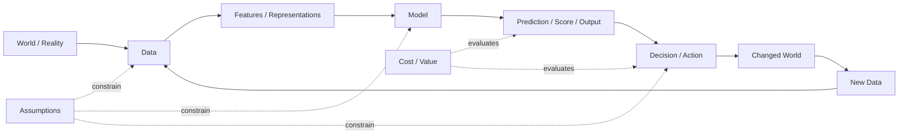

The model is only one part of the system. The real system includes:

- the data that creates the model;
- the assumptions that make learning possible;
- the decision that uses the output;
- the world that changes after the decision;
- the new data created by those changes.

---

## 1. Foundations Of Learning

### Core Questions

- Why can a machine learn from finite data?
- What must be true for past data to help with future decisions?
- What assumptions are we making about the world?
- What patterns are stable enough to learn?
- What patterns are temporary, noisy, biased, or accidental?
- What does it mean for a model to generalize?
- What does it mean for a model to overfit?
- What is the difference between memorizing examples and learning reusable structure?

### Core Concepts

- **Generalization** — the model performs well on unseen data, not only on training data.
- **Inductive bias** — the assumptions a model uses to learn from limited examples.
- **No-free-lunch principle** — no model is best for every possible problem.
- **IID assumption** — examples are assumed to be independent and identically distributed. In practice, independence often breaks with time series, repeated users, grouped clients, duplicated entities, and feedback loops.
- **Stationarity** — the data distribution and/or input-output relationship remains stable enough over time. When this breaks, it appears as covariate drift, data drift, or concept drift.
- **Bias-variance tradeoff** — simple models may underfit; overly flexible models may overfit.
- **Signal vs noise** — useful patterns must be separated from random variation.

### Visual Model

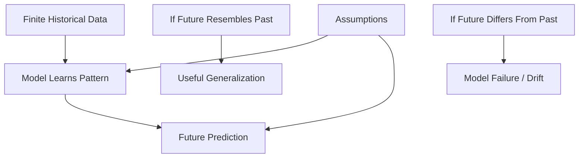

### Why This Matters

ML is not magic. It works when the future resembles the past in ways the model can capture. If that assumption is false, more modeling complexity does not solve the real problem.

---

## 2. ML In The Larger System Landscape

### Core Questions

- What is ML?
- What is not ML?
- How is ML different from fixed code, rules, SQL, dashboards, analytics, statistics, AI, and LLMs?
- When is a simple rule better than ML?
- When is analytics enough?
- When is optimization enough?
- When is an LLM useful without training a new model?
- When is ML unnecessary complexity?

### Conceptual Hierarchy

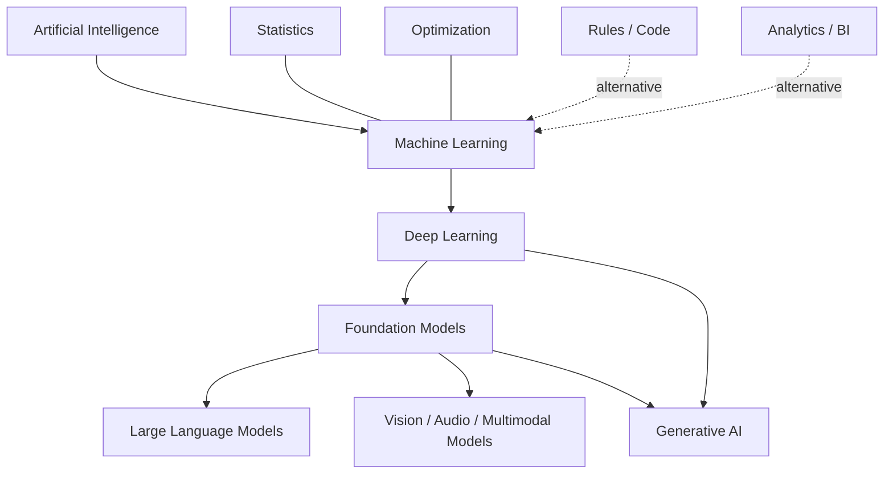

### System Types

| System Type | What It Does | Best Used When |
|---|---|---|
| Fixed code / rules | Applies explicit logic | Rules are known and stable |
| SQL / reporting | Summarizes known data | Need visibility, not prediction |
| Analytics / BI | Explains what happened | Need diagnosis or monitoring |
| Statistics | Estimates relationships and uncertainty | Need inference, testing, explanation |
| Optimization | Finds best option under constraints | Objective and constraints are known |
| Classical ML | Learns predictive patterns from structured data | Need prediction, ranking, classification |
| Deep learning | Learns representations from large/high-dimensional data | Text, images, audio, complex patterns |
| LLM / generative AI | Produces or interprets language/content | Need generation, extraction, summarization, reasoning-like behavior |

### Important Nuance

- AI, ML, deep learning, and LLMs are not equal siblings.
- ML is largely built on statistics, but the culture differs:
  - statistics often emphasizes inference and explanation;
  - ML often emphasizes prediction and generalization.
- Prompting an LLM is not training a model, but the LLM itself is a machine learning model.
- “Reasoning” in LLMs should be treated carefully. It is useful behavior, but the nature of that reasoning is debated.

---

## 3. Purpose And Problem Framing

### Core Questions

- What problem are we solving?
- Why is learning from data useful here?
- What is hard to express as fixed logic?
- What decision, prediction, ranking, grouping, detection, or generation are we trying to improve?
- Who or what consumes the output?
- What action happens after the output?
- What is the cost of a wrong decision?
- What is the value of a correct decision?
- What does “good” mean before we choose a model?
- Are there multiple objectives in tension?

### ML Task Types

| Task Type | Question It Answers | Example Output |
|---|---|---|
| Classification | Which category? | spam / not spam |
| Regression | How much? | predicted revenue |
| Ranking | What should come first? | prioritized queue |
| Forecasting | What happens next over time? | future demand |
| Clustering | What groups exist? | customer segments |
| Anomaly detection | What looks unusual? | fraud alert |
| Recommendation | What should be suggested? | next item |
| Generation | What should be created? | text, image, code |
| Extraction | What structured info is inside unstructured input? | entities, fields |

### Framing Flow

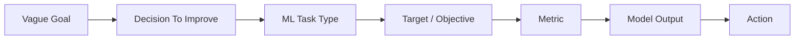

### Core Principle

Choosing the objective is not a training detail. It defines what “good” means. A technically strong model can still be useless if the objective does not match the real decision.

Most real systems do not have one objective. They balance several objectives at the same time:

- quality;
- coverage;
- cost;
- latency;
- fairness;
- risk;
- interpretability;
- user trust.

This creates tradeoffs. The goal is often not a single optimum, but an acceptable operating point across competing constraints.

---

## 4. Data And Labels

### Core Questions

- What data exists?
- What data is missing?
- What is the unit of prediction?
- What is one training example?
- What is the label?
- How was the label created?
- Is the label reliable?
- Is the label noisy, delayed, biased, subjective, or incomplete?
- What features are available before the prediction moment?
- What features leak the answer?
- What data should never be used?
- Is there enough data?
- Does the data represent the future use case?

### Data Concepts

- **Observation/unit** — one row/example the model learns from.
- **Feature** — input used by the model.
- **Label/target** — value the model learns to predict.
- **Training data** — examples used to fit the model.
- **Validation data** — examples used to tune and compare.
- **Test data** — held-out examples used for final evaluation.
- **Leakage** — information enters training that would not be available at prediction time.
- **Sampling bias** — dataset does not represent the population or future use case.
- **Label noise** — labels are wrong, inconsistent, or only approximate.
- **Data drift** — input distribution changes over time.
- **Concept drift** — relationship between input and target changes over time.

### Labeling As A Discipline

Labels do not simply “exist.” They are produced through some process:

- human annotation;
- business rules;
- historical outcomes;
- weak supervision;
- synthetic generation;
- self-supervision;
- user behavior;
- downstream events.

Important label questions:

- Who created the label?
- Was there a rubric?
- Do multiple annotators agree?
- Is the label a proxy for the true goal?
- Can the label be gamed?
- Does the label arrive late?
- Is the label biased by previous decisions?

### Cold Start And Bootstrapping

Many real ML systems start before labels are available.

Common bootstrapping path:

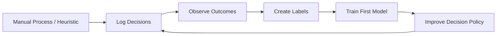

Cold-start questions:

- What can be done before a model exists?
- What heuristic can collect useful training data?
- What outcome should be logged as a future label?
- How much human review is needed early?
- When is there enough signal to train?
- How do we avoid training only on biased historical actions?

---

## 5. Data Preparation And Feature Work

### Core Questions

- What must happen before modeling?
- How should raw data become training rows?
- What cleaning is required?
- What missing values exist?
- What outliers exist?
- What categorical values need encoding?
- What numerical values need scaling?
- What time window should be used?
- What features should be engineered?
- What baseline should the model beat?
- Should features be manually engineered or learned by the model?

### Preparation Pipeline

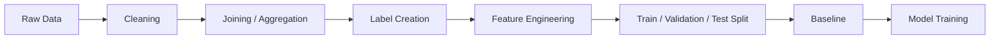

### Feature Engineering Vs Representation Learning

| Approach | Meaning | Usually Used With |
|---|---|---|
| Feature engineering | Humans design useful inputs | Classical ML, structured data |
| Representation learning | Model learns useful internal features | Deep learning, embeddings, foundation models |

Neither is always better. Structured business data often benefits from explicit feature engineering. Text, images, audio, and high-dimensional data often benefit from representation learning.

### Leakage Checklist

- Is the feature available before prediction time?
- Was the feature created using the target?
- Does the feature contain a future event?
- Does the feature encode a business rule that already includes the answer?
- Are duplicates crossing train/test boundaries?
- Is the same user/client/entity in both train and test when that would inflate results?
- Is the validation split aligned with real-world usage?

---

## 6. Model Strategy

### Core Questions

- Do we need ML at all?
- What is the simplest useful baseline?
- Should we use rules, classical ML, deep learning, pretrained models, fine-tuning, RAG, or an API?
- What model family fits the data and task?
- What assumptions does the model make?
- How much interpretability is required?
- How much latency, cost, and complexity are acceptable?
- Is the model the bottleneck, or is data/label quality the bottleneck?

### Build-Vs-Buy / Modern ML Decision Axis

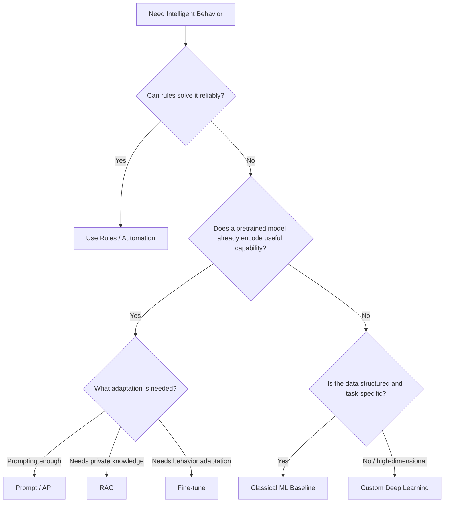

### Model Families

| Family | Strength | Tradeoff |
|---|---|---|
| Rules / heuristics | Simple, explainable | Brittle when patterns are complex |
| Linear/logistic models | Interpretable, strong baseline | Limited non-linear patterns |
| Trees | Handles non-linear rules | Can overfit |
| Random forests / boosting | Strong tabular performance | Less interpretable |
| Neural networks | Flexible, representation learning | Data-hungry, harder to interpret |
| Embedding models | Semantic similarity/search | Need careful retrieval/eval |
| LLMs/foundation models | Broad language/knowledge capabilities | Cost, latency, hallucination, control |

---

## 7. Training

### Core Questions

- What does the model learn from?
- What data is used for training?
- What target is being optimized?
- What loss function is used?
- What hyperparameters matter?
- How do we optimize for generalization, not just training performance?
- How do we handle imbalance?
- How do we make training reproducible?

### Core Concepts

- **Loss function** — mathematical penalty the model tries to minimize.
- **Optimization** — process of adjusting model parameters.
- **Gradient descent** — common method for optimizing differentiable models.
- **Hyperparameters** — settings chosen before training.
- **Regularization** — constraints that reduce overfitting.
- **Class weighting** — gives more importance to underrepresented classes.
- **Random seed** — helps reproducibility.

### Memorization Reframe

The goal is not “no memorization.” Some memorization is normal and sometimes necessary. The real goal is **generalization**: the model should perform well on unseen examples.

---

## 8. Evaluation And Validation

### Core Questions

- How do we know the model works?
- What baseline does it beat?
- Which validation split matches real-world usage?
- What metric reflects the actual decision?
- Are we measuring prediction quality or decision value?
- Are results stable across groups, time, and segments?
- Is the difference between two models real, or could it be measurement noise?
- Is the model calibrated?
- Does the model know when it is uncertain?

### Split Types

| Split Type | Use Case | Risk |
|---|---|---|
| Random split | Simple independent examples | Can overestimate performance |
| Group/entity split | Need generalization to new users/clients/entities | Harder but more realistic |
| Time split | Need future prediction | Best for temporal problems |
| Geographic split | Need location generalization | Exposes region bias |
| User split | Need new-user generalization | Prevents user leakage |

Random splits only make sense when examples are close to independent. If many rows come from the same user, client, page, device, organization, or time period, independence is violated. In those cases, random splits often leak entity-specific or time-specific patterns into both train and test.

This is why group splits and time splits are not details. They test whether the model generalizes in the same way it will be used.

### Metric Types

| Goal | Useful Metrics |
|---|---|
| Classification | accuracy, precision, recall, F1, ROC AUC, PR AUC |
| Ranking | precision@K, recall@K, NDCG, MAP |
| Forecasting | MAE, RMSE, MAPE, backtesting |
| Clustering | silhouette, stability, human usefulness |
| Generation | human eval, rubric eval, factuality, safety, task success |
| Decision systems | utility, cost saved, revenue, risk reduction |

### Key Distinction

Model metric is not the same as real-world value.

A model can improve ROC AUC and still fail if:

- the top recommendations are not useful;
- the action cost is too high;
- users ignore the output;
- the metric rewards the wrong behavior;
- the decision changes future data in harmful ways.

### Statistical Confidence

Metric differences should not automatically be treated as real improvements.

Ask:

- Is model A better than model B by enough to matter?
- Could the difference be random variation from the validation sample?
- Does a confidence interval on the difference between models exclude zero?
- Does the result hold across time windows, entities, or important segments?
- Does the better offline metric translate into better decision value?

Useful tools:

- confidence intervals;
- bootstrap resampling;
- repeated cross-validation;
- segment-level evaluation;
- time-window backtesting;
- online experimentation.

---

## 9. Outputs And Decision Policies

### Core Questions

- What does the model produce?
- Is the output a class, probability, score, rank, forecast, cluster, recommendation, or generated artifact?
- What threshold turns model output into action?
- When should the system abstain?
- When should a human review the output?
- What post-processing is required?
- How is uncertainty represented?

### Output Types

| Output | Example | Used For |
|---|---|---|
| Class | churn / no churn | Direct categorization |
| Probability | 0.82 risk | Risk scoring |
| Score | 91/100 priority | Prioritization |
| Rank | item #1, #2, #3 | Queues/search/recommendations |
| Cluster | segment A/B/C | Discovery |
| Forecast | next month demand | Planning |
| Generated text/image/code | draft output | Creation/assistance |
| Explanation | reason codes/features | Human trust/review |

### Decision Policy

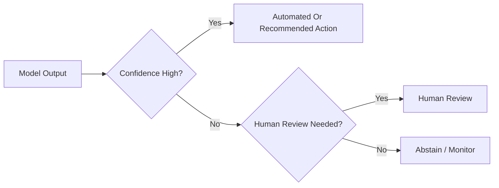

### Uncertainty

Uncertainty should be first-class:

- **Aleatoric uncertainty** — the world is inherently noisy.
- **Epistemic uncertainty** — the model lacks knowledge or data.
- **Calibration** — predicted probabilities match real-world frequencies.
- **Abstention** — the model should sometimes say “I do not know.”
- **Confidence thresholds** — define when to act, review, or ignore.

---

## 10. Interpretation And Trust

### Core Questions

- Why did the model produce this result?
- Which features matter?
- Are explanations stable?
- Can a human verify the output?
- Is the model using reasonable signals?
- Is the explanation faithful or only decorative?
- What should be shown to users?

### Interpretation Tools

| Tool | Use |
|---|---|
| Feature importance | Understand broad drivers |
| Coefficients | Interpret linear models |
| Tree paths | Inspect decision logic |
| SHAP / LIME | Local explanation of predictions |
| Counterfactuals | What would change the output? |
| Reason codes | Human-readable action rationale |
| Model cards | Document purpose, limits, risks |

### Trust Principle

Interpretability is not only about explaining a model. It is about deciding whether the model should be trusted for a specific decision under specific assumptions.

---

## 11. Decisions, Actions, And Feedback Loops

### Core Questions

- What action follows the model output?
- Does the action change the future data?
- Can the model create its own feedback loop?
- Are we evaluating the prediction or the decision?
- Could optimizing the metric harm the real goal?
- How do we evaluate a decision before deploying it?

### Feedback Loop

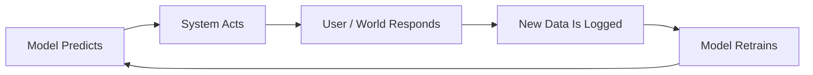

### Core Concepts

- **Decision utility** — value of the action, not only prediction accuracy.
- **Cost-sensitive evaluation** — false positives and false negatives have different costs.
- **Goodhart’s law** — when a proxy metric becomes the target, it can stop being useful.
- **Feedback loop** — model actions change future data.
- **Counterfactual problem** — we often do not know what would have happened under a different action.
- **Off-policy evaluation** — estimating a new decision policy from logs of previous decisions.

### Why This Matters

ML systems do not only observe the world. Once deployed, they often change the world they later learn from.

---

## 12. Causality, Experimentation, And Sequential Decisions

### Core Questions

- Are we trying to predict what will happen, or determine what action will cause improvement?
- Is the model learning correlation or causal effect?
- What intervention are we considering?
- What would have happened if we had taken a different action?
- Can we measure the action's real effect, not only the model's prediction quality?
- Do decisions happen once, or repeatedly over time?
- Does the system need to explore new actions to learn?

### Prediction Vs Causation

Prediction answers:

> Given what we observe, what is likely to happen?

Causation answers:

> If we change something, what will happen because of that change?

These are different questions.

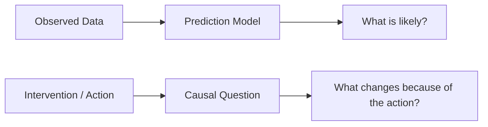

### Why Correlation Is Not Enough

A predictive model may learn that two things move together. That does not prove one causes the other.

For action-taking systems, this matters because:

- acting on correlations can waste effort;
- the model may prioritize symptoms instead of causes;
- historical data reflects previous decisions;
- the best predicted outcome may not be the best intervention target;
- the action itself can change future behavior and future data.

### Causal Concepts

| Concept | Meaning |
|---|---|
| Intervention | A change deliberately applied to the system |
| Treatment | The action being tested |
| Control | The comparison group without the treatment |
| Treatment effect | Difference caused by the treatment |
| Uplift modeling | Predicting who benefits most from an action |
| Counterfactual | What would have happened under a different action |
| Confounding | Hidden factor affects both action and outcome |

### Experimentation Bridge

Offline validation answers:

> Does the model predict well on held-out data?

Online experimentation answers:

> Does using the model improve the real decision?

| Method | Use |
|---|---|
| A/B test | Compare action policy against control in the real world |
| Holdout group | Preserve an untreated comparison group |
| Bandit | Balance exploration and exploitation across actions |
| Off-policy evaluation | Estimate a new policy from logs before deployment |
| Backtesting | Evaluate historical time-based behavior |

### When You Cannot Run An Experiment

Sometimes a clean randomized experiment is not available. Historical business data often contains actions that already happened, but not randomized controls.

In those cases, observational causal inference can help, but it requires stronger assumptions than A/B testing.

| Method | Use | Main Caution |
|---|---|---|
| Propensity scoring | Compare treated and untreated examples with similar likelihood of receiving treatment | Only adjusts for observed confounders |
| Difference-in-differences | Compare before/after changes between treated and comparison groups | Requires parallel-trends assumption |
| Instrumental variables | Use external variation that affects treatment but not outcome directly | Valid instruments are hard to find |
| Regression discontinuity | Use threshold-based assignment as a quasi-experiment | Only estimates effect near the threshold |
| Matching | Pair similar treated and untreated examples | Quality depends on matching variables |

Practical rule:

> If you cannot randomize, be explicit about the causal assumptions. Observational causal claims are useful only when those assumptions are defensible.

### Sequential Decisions

Some systems make one decision. Others make repeated decisions where each action affects the next state.

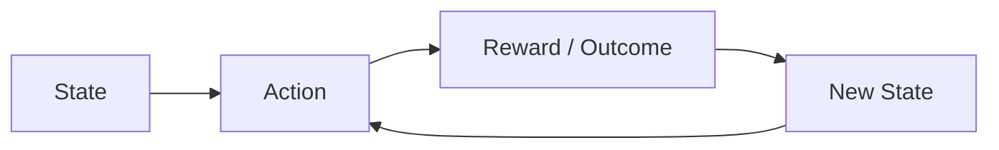

This is the territory of:

- **contextual bandits** — choose an action now, learn from reward;
- **reinforcement learning** — learn sequences of actions over time;
- **policy optimization** — improve the decision rule, not only the prediction.

Most applied ML systems do not need deep reinforcement learning. But they still need the concept: if the system acts repeatedly, decisions and data form a loop.

### Practical Principle

If the goal is to act, ask:

- What action will we take?
- What outcome should that action cause?
- How will we know the action caused the outcome?
- What control or comparison do we have?
- How do we avoid optimizing a proxy that does not improve the real goal?

---

## 13. Failure Modes

### Core Questions

- How can this fail?
- Is the model learning leakage?
- Is it overfitting?
- Is it biased?
- Is it optimizing the wrong proxy?
- Is data stale?
- Is the model vulnerable to manipulation?
- Would failure be visible or silent?

### Failure Types

| Failure | Meaning |
|---|---|
| Leakage | Model learns information unavailable at prediction time |
| Overfitting | Model performs well on training data but poorly on new data |
| Underfitting | Model is too simple to capture signal |
| Bad labels | Target is noisy, biased, or wrong |
| Distribution shift | Future data differs from training data |
| Concept drift | Relationship between inputs and output changes |
| Goodhart failure | Proxy metric is optimized at expense of real goal |
| Feedback loop | Model output changes future training data |
| Bias/fairness issue | Performance or harm differs across groups |
| Security issue | Poisoning, extraction, prompt injection, PII leakage |
| Silent failure | System continues running while quality degrades |

---

## 14. Deployment And MLOps

### Core Questions

- How is the model used in production?
- Is prediction batch or real-time?
- Where does inference happen?
- How are outputs stored?
- How are versions tracked?
- How do we roll back?
- How do we monitor quality?
- What happens when the model fails?

### MLOps Components

- reproducible pipelines;
- dataset versioning;
- feature definitions;
- model registry;
- experiment tracking;
- CI/CD for model code and data pipelines;
- batch or real-time serving;
- monitoring;
- alerting;
- rollback;
- retraining workflows;
- audit logs.

### Deployment Modes

| Mode | Use Case |
|---|---|
| Batch scoring | Periodic queues, reports, prioritization |
| Real-time API | Instant decisions in applications |
| Embedded model | Local/mobile/edge prediction |
| Human-in-loop | Review before action |
| Assistant/copilot | Model suggests; human decides |

---

## 15. Monitoring And Improvement

### Core Questions

- Is the model still accurate?
- Is the data distribution changing?
- Are predictions changing?
- Are users trusting the output?
- Are decisions creating value?
- What errors happen most often?
- Do we need better data, better labels, better features, or a better model?
- Is the model actually the bottleneck?

### Monitoring Types

| Monitoring Type | What It Tracks |
|---|---|
| Data drift | Input distribution changes |
| Prediction drift | Output distribution changes |
| Performance drift | Metrics degrade over time |
| Business KPI drift | Real-world value changes |
| Segment performance | Failures by group/client/user/entity |
| Operational health | latency, cost, errors, uptime |

### Improvement Loop

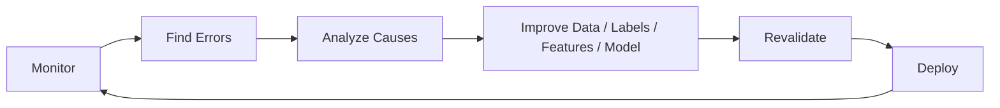

---

## 16. Ethics, Governance, Privacy, And Security

### Core Questions

- Should this model exist?
- Is the data allowed to be used?
- Could the model harm users?
- Can the decision be explained or appealed?
- Does the system treat groups fairly?
- Could private data be memorized or leaked?
- Could someone manipulate the model?
- Who is accountable for the output?

### Governance Areas

- privacy;
- consent;
- fairness;
- compliance;
- auditability;
- security;
- responsible AI;
- human review;
- escalation paths;
- documentation.

### Security-Specific Risks

- data poisoning;
- model extraction;
- adversarial examples;
- prompt injection;
- training data leakage;
- PII memorization;
- unauthorized model access.

---

## 17. Cost, ROI, And Practicality

### Core Questions

- Is ML worth the cost?
- What is the cost of data collection?
- What is the cost of labeling?
- What is the cost of infrastructure?
- What is the cost of monitoring and maintenance?
- How much value does the model create?
- Would a heuristic create most of the value with less risk?
- Is the model solving the actual bottleneck?

### Cost/Value Lens

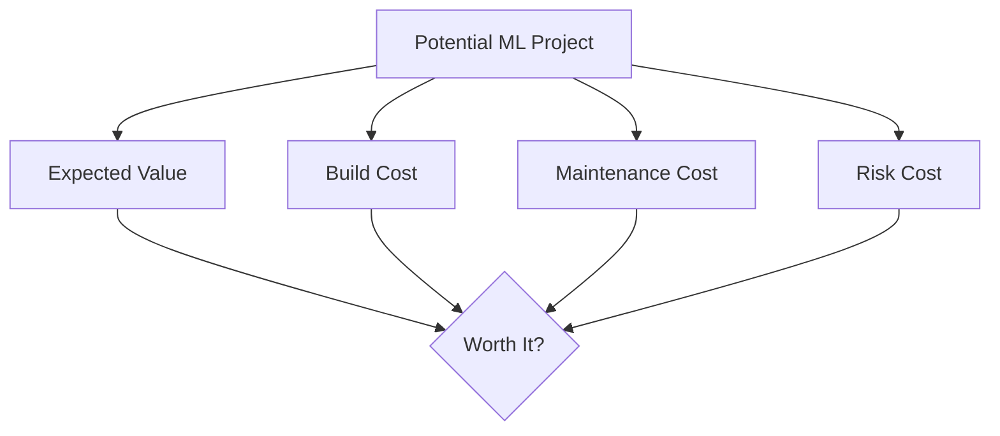

### Practical Rule

The best ML solution is not the most advanced model. It is the simplest system that creates reliable value under acceptable cost and risk.

### Multi-Objective Tradeoffs

ML systems often optimize more than one goal:

| Objective | Possible Tension |
|---|---|
| Accuracy | May increase latency or complexity |
| Precision | May reduce coverage |
| Recall | May increase false positives |
| Fairness | May require different thresholds or constraints |
| Cost | May limit model size or serving frequency |
| Interpretability | May limit model complexity |
| User experience | May conflict with short-term business metrics |

The practical question is:

> Which tradeoff is acceptable for this decision?

---

## 18. Cross-Cutting Spines

These are not stages. They apply across the whole ML system.

### Spine 1: Assumptions

At every stage, ask:

- What must be true for this to work?
- Will that remain true in the future?
- How would we know if it stops being true?
- Which assumption is most fragile?

| Stage | Assumption Example |
|---|---|
| Problem | The target matches the real decision |
| Data | Historical data represents future data |
| Labels | Labels are meaningful and consistent |
| Features | Features are available at prediction time |
| Model | Model bias fits the pattern |
| Evaluation | Test split matches deployment reality |
| Deployment | Users act on outputs as expected |
| Monitoring | Drift and failures can be detected |

### Spine 2: Cost / Value

At every stage, ask:

- What value does this create?
- What does it cost to build?
- What does it cost to maintain?
- What does failure cost?
- Is a simpler system enough?

| Stage | Cost/Value Question |
|---|---|
| Problem | Is this decision valuable enough to improve? |
| Data | Is data collection/labeling worth it? |
| Model | Does complexity add measurable value? |
| Evaluation | Does metric improvement translate into real value? |
| Deployment | Is latency/infrastructure cost acceptable? |
| Monitoring | Is maintenance effort justified? |

---

## 19. Complete First-Principles Checklist

Use this when starting any ML problem from scratch.

### A. Identity

- What is the system trying to do?
- Is this actually ML?
- What simpler alternatives exist?
- Why are rules or analytics not enough?

### B. Learning Assumptions

- What patterns should transfer from past to future?
- What could break that assumption?
- Is the environment stable enough?

### C. Decision

- What decision is improved?
- Who acts on the output?
- What is the cost of being wrong?
- What is the value of being right?

### D. Data

- What is one training example?
- What is the label?
- How was the label created?
- What features are available before prediction?
- Is there leakage?
- Is there enough data?

### E. Model Strategy

- What baseline should be built first?
- What model family fits the task?
- Should we use custom ML, pretrained models, RAG, fine-tuning, or API usage?
- What complexity is justified?

### F. Evaluation

- What split matches reality?
- What metric matters?
- Does the model beat the baseline?
- Does it improve the decision, not only the prediction?
- Is the improvement statistically meaningful?

### G. Causality And Experimentation

- Are we predicting an outcome or estimating the effect of an intervention?
- What action will be taken?
- What control or comparison exists?
- Can an A/B test or holdout prove real decision value?
- Is the system making one decision or repeated sequential decisions?

### H. Output

- What exactly is produced?
- How is uncertainty shown?
- What threshold or policy turns output into action?
- When should the model abstain?

### I. Trust

- Can the output be explained?
- Are important features reasonable?
- Can a human audit the result?

### J. Deployment

- Where does prediction run?
- Is it batch or real-time?
- How are versions tracked?
- How is rollback handled?

### K. Monitoring

- What drift is monitored?
- What performance is monitored?
- What triggers retraining?
- What failure modes are expected?

### L. Governance

- Is the data allowed?
- Is the system fair enough?
- Is private data protected?
- Who is accountable?

---

## 20. Final Mental Model

ML is not:

```text
data -> train model -> get answer
```

ML is:

```text
assumptions + data + objective + model + validation + causality + decision + monitoring + feedback
```

The highest-level ML question is not:

> Which model should we use?

It is:

> What decision should improve, what data can support that improvement, what assumptions must hold, and what system can create reliable value over time?
